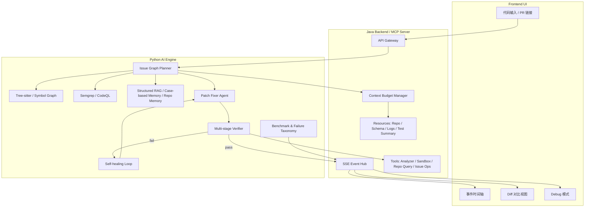

# 🛡️ Sentinel-CR: 基于验证闭环、结构化经验记忆与多引擎协同的智能代码修复平台  
## Verified AI Code Repair Agent

<div align="center">


</div>

---

## 📖 项目定位

**Sentinel-CR** 不是一个“只会读代码然后输出评论”的 AI Code Review Demo，而是一套以 **Verified Patch（可验证补丁）** 为交付目标的 **工程化代码修复系统**。

它的目标不是“告诉开发者哪里可能有问题”，而是把完整链路真正打通：

> **发现问题 → 理解影响范围 → 规划修复顺序 → 生成 Patch → 沙箱验证 → 失败反思重试 → 输出已分级验证的补丁**

与传统仅依赖大模型的代码审查工具不同，Sentinel-CR 采用的是 **确定性分析器 + 结构化代码理解 + LLM 补丁生成 + 多阶段验证闭环 + 持续评测回归** 的混合架构。  
系统不仅要“会找问题”，更要“会改、敢改、改完能证明自己改对了”。

---

## 🎯 这次重构后的核心提升点（相对普通 AI Code Review 的升级）

这一版不是简单换了几个名词，而是把项目从“会说”升级为“会做、会验、会度量”。

### 1. 从“报告优先”升级为“Patch 优先”
过去很多 AI Code Review 工具输出的是一份长篇 Markdown 建议，但真正落地时，开发者还需要自己手动修改代码。  
本项目改为 **Patch-first** 思路，最终产物优先输出 **Unified Diff 标准补丁**，前端直接展示差异，用户可以按块查看、采纳或回滚。

### 2. 从“单纯 RAG”升级为“结构化经验记忆 + Case-based Reasoning”
过去的 RAG 往往只是把规范文档切块后检索回来拼进 Prompt。  
本项目把长期经验沉淀为结构化案例单元，例如：

```json
{
  "pattern": "N+1 query in loop",
  "language": "Java",
  "framework": "Spring Data JPA",
  "trigger_signals": ["repository.findById inside loop"],
  "before_code": "...",
  "after_code": "...",
  "diff": "...",
  "risk_note": "batch query may increase memory usage",
  "success_rate": 0.91
}
```

这样 Agent 不再只是“读到一条规范然后重新编”，而是能够：
- 检索相似历史修复案例
- 基于已有成功补丁做 **Patch Adaptation（补丁适配）**
- 优先复用已被验证过的修复套路，降低幻觉率

### 3. 从“平铺直叙的 Planner”升级为“Issue Graph Planner”
普通 Planner 往往只是把扫描结果列成清单。  
这一版引入 **Issue Graph（问题依赖图）**，把每个缺陷和它关联的符号、文件、影响范围组织成图结构，支持：
- 依赖感知的修复顺序决策
- 避免多个 patch 互相冲突
- 识别哪些问题需要跨文件修改
- 识别哪些问题必须在修复前先补上下文或测试

### 4. 从“编译一下就结束”升级为“多阶段 Verifier”
很多项目的“验证”只停留在能不能编译通过。  
本项目将验证机制拆成分层流水线，补丁会得到明确验证等级：

- **L1：Compile Pass** —— 语法、依赖、基本编译通过
- **L2：Lint Pass** —— 风格、静态规范、潜在坏味道通过
- **L3：Test Pass** —— 单元测试或回归测试通过
- **L4：Security Re-scan Pass** —— 安全规则复扫未引入新问题

这样系统输出的不只是“成功 / 失败”，而是一个可解释、可量化的 **Verified Level**。

### 5. 从“直接暴露思维链”升级为“事件流 + Debug Mode”
原始 CoT（思维链）虽然看起来炫，但在产品层面往往：
- 噪声多
- 不稳定
- 前端难解析
- 对用户价值有限

这一版改成 **Event Stream UI**：
- 用户模式：展示进度轴和关键事件
- 调试模式：展示分析器结果、上下文选择、补丁迭代次数、失败原因

也就是说：
- 普通用户看的是“流程状态”
- 开发和面试演示时看的是“系统可观测性”

### 6. 从“只统计成功率”升级为“Failure Taxonomy 失败分类体系”
系统不只关心“这次成没成”，更关心“为什么没成”。  
本项目新增失败分类标准，例如：

- **F1：Detection Miss** —— 根本没检出问题
- **F2：Wrong Patch** —— 生成了错误修复
- **F3：Compile Error** —— Patch 应用后无法编译
- **F4：Test Fail** —— 编译能过但测试失败
- **F5：Regression Introduced** —— 修了旧问题又带来新问题
- **F6：Context Insufficient** —— 缺乏上下文导致修复不完整

这让评测不再只是一个“通过率数字”，而是可以真正指导后续 Prompt、Analyzer、Memory、Verifier 的迭代方向。

---

## ✨ 核心能力设计

## 1. 🏗️ 混合扫描引擎：AST 代码理解 + 确定性分析器 + LLM 协同

### 为什么要这样设计
直接把代码丢给 LLM 做审查，最大的问题就是：
- 容易漏问题
- 容易编造不存在的缺陷
- 很难稳定复现
- 很难对结果负责

因此本项目把“发现问题”和“修复问题”拆开：

### 这一层具体由什么组成
#### ① Tree-sitter 代码结构理解
使用 **Tree-sitter** 做多语言 AST 解析，提取：
- 类、方法、字段、注解
- import / package
- 调用关系
- 变量读写位置
- 变更点附近的语法上下文

这一步不是为了做炫技的 AST 可视化，而是为了给上层 Agent 一个 **repo-aware / symbol-aware** 的结构化输入。

#### ② Semgrep / CodeQL 确定性分析
使用 Semgrep 做高性价比、规则驱动的漏洞和规范扫描；在复杂或高价值场景下引入 CodeQL 做更深层的数据流和污点分析。  
这样可以把问题分成两类：
- **确定性可检测的问题**：尽量交给分析器
- **需要语义修复和重构的问题**：交给 LLM

#### ③ LLM 的角色重新定义
在本项目里，LLM 不负责“盲找 Bug”，而负责：
- 解释 Analyzer 的发现结果
- 合并多来源证据
- 生成修复方案和 Diff
- 根据验证失败信息做反思与重试

> 这使得 LLM 从“唯一判断者”变成“高层修复执行器”，系统稳定性会显著提升。

---

## 2. 🧭 Issue Graph Planner：从扫描结果到依赖感知修复计划

普通系统拿到扫描结果后，会直接让模型一条条修。  
但真实工程中，修复顺序是很重要的：先修哪一个、会不会影响另一个、是否需要一起改动。

因此 Sentinel-CR 引入 **Issue Graph Planner**。

### Planner 输入
- AST / symbol graph 提取结果
- Semgrep / CodeQL 扫描结果
- 变更文件和受影响方法
- 历史案例检索结果
- 用户额外约束（例如“不能改接口签名”“必须保持强一致性”）

### Planner 输出
每个问题会被组织成如下结构：

```json
{
  "issue_id": "ISSUE-001",
  "type": "sql_injection",
  "severity": "high",
  "location": "src/main/java/.../UserController.java:42",
  "related_symbols": ["createUser", "userMapper.insert"],
  "depends_on": [],
  "conflicts_with": ["ISSUE-003"],
  "fix_strategy": "parameterized_query",
  "fix_scope": "single_file",
  "requires_test": true
}
```

### 它解决了什么问题
- 避免多个问题同时修改同一段代码导致 patch 冲突
- 对跨文件问题提前做修复分组
- 知道什么问题必须先修，什么问题可以并行
- 为 Fixer Agent 提供更清晰、更约束化的任务边界

---

## 3. 🧠 结构化经验记忆库：从“文档检索”到“经验复用”

很多项目写了 RAG，但真正落地时还是一堆切块文档。  
这一版明确把记忆分成两类：

### ① 短期记忆（Short-term Memory）
保存当前线程上下文：
- 当前代码片段
- 上一次 patch
- 最近一次 verifier 报错
- 用户补充的约束条件
- 当前重试次数

这保证多轮修复过程中，Agent 不会“失忆”。

### ② 长期记忆（Long-term Memory）
沉淀结构化经验单元：
- 常见 Bug Pattern
- 触发信号
- 成功补丁案例
- 风险说明
- 验证结果
- 人工是否接受过该方案

### ③ Repo-level Memory（仓库级经验）
为了让系统更贴近真实工程，本项目进一步加入 **Repo-level Memory**：
- 某个仓库常见的代码风格偏好
- 常出现的错误类型
- 项目测试组织方式
- 历史上被人工拒绝的修复模式

这意味着系统不仅是“通用修复器”，还可以逐渐变成“对某个仓库更懂行的修复器”。

---

## 4. 🔄 多阶段 Verifier：让补丁从“看起来合理”变成“有证据地可信”

Verifier 是本项目最核心的工程亮点之一。

### 核心流程
Fixer 生成补丁后，不会直接返回用户，而是进入多阶段验证链路：

1. **Patch Apply**
   - 将 Diff 应用到临时工作目录
   - 检查 patch 是否能正确打上

2. **Compile**
   - Java 场景下执行 `javac` 或 `mvn -q -DskipTests compile`
   - 验证语法和依赖层面是否可通过

3. **Lint**
   - 执行 Checkstyle / SpotBugs / PMD 等
   - 防止修复代码虽然能编译，但引入了明显的坏味道

4. **Unit Test / Regression Test**
   - 运行受影响测试或最小回归测试集
   - 检查行为是否被破坏

5. **Security Re-scan**
   - 对补丁后的代码再次跑 Semgrep / CodeQL
   - 避免“修一个漏洞又引入另一个漏洞”

### 验证等级输出
```json
{
  "verified_level": "L3",
  "passed_stages": ["patch_apply", "compile", "lint", "unit_test"],
  "failed_stages": [],
  "retry_count": 1
}
```

### Reflection 闭环
如果任何一步失败，系统不会简单放弃，而是把失败信息结构化传给 Fixer：

```json
{
  "failure_stage": "compile",
  "stderr_summary": "cannot find symbol UserDTO",
  "likely_reason": "missing import or wrong type name",
  "retry_budget_left": 2
}
```

Fixer 会基于失败原因重新生成补丁，实现 **Self-healing Loop（自愈式修复闭环）**。

---

## 5. 🔌 MCP Server：Resources + Tools 双通道 + Lazy Context System

### 为什么不是把所有代码都塞给 Prompt
真实仓库往往很大，直接把仓库文件整体喂给模型会遇到：
- 上下文超长
- 费用过高
- 噪声过多
- 模型注意力被稀释

因此，本项目把 Java 后端设计为 **MCP Server**，暴露两种能力：

### ① Resources（资源）
- Repo 文件树
- 指定文件内容
- Schema / API 契约
- 历史构建日志
- 测试结果摘要

### ② Tools（工具）
- 拉取文件片段
- 运行分析器
- 启动沙箱验证
- 创建 issue / 提交修复建议
- 查询某个 symbol 的引用关系

### Lazy Context System（渐进式上下文加载）
在 MCP 之上，再增加一层 **Context Budget Manager**：
- 先加载摘要，不够再展开
- 先加载变更点附近代码，不够再扩上下文
- 优先返回 AST summary / symbol summary，而不是整文件全文
- 根据 token 预算动态决定是否继续取资源

这使系统的上下文获取更像“按需取证”，而不是“无脑塞上下文”。

---

## 6. 🌊 事件驱动 UI：产品可用性与系统可观测性兼顾

### 用户模式（User Mode）
普通用户看到的是清晰、简洁的事件流：
- AST 解析中
- Semgrep 扫描中
- 检测到 2 个高危问题
- 生成修复补丁中
- 编译验证通过
- 已输出 L3 Verified Patch

### 调试模式（Debug Mode）
调试模式下可以额外看到：
- Analyzer 输出摘要
- 当前选取的上下文范围
- Case-based Memory 命中情况
- 第几轮 Fixer / Verifier 重试
- 每轮失败原因
- 最终失败分类

这层设计非常适合：
- 本地调试
- 面试演示
- 后续做系统运维和效果分析

---

## 7. 📊 Benchmark：从“看起来不错”到“可量化迭代”

### Golden Dataset
项目内置一套黄金测试集，覆盖典型问题：
- 空指针
- SQL 注入
- N+1 查询
- 并发竞争
- 错误日志处理
- 资源泄漏
- API 误用
- 异常吞掉
- 错误的 equals/hashCode
- 可空参数校验缺失

### 指标设计
除了传统的成功率，本项目还会持续统计：
- 问题检出率
- Patch 生成率
- Patch Apply 成功率
- Compile Pass Rate
- Lint Pass Rate
- Test Pass Rate
- 最终 Verified Patch 率
- 平均重试次数
- 平均耗时
- Token 成本

### Failure Taxonomy
如果失败，则必须归类到具体失败桶中，而不是简单记成“失败一次”。  
这样每次迭代都能知道：
- 是 Analyzer 漏了
- 是 Fixer 编错了
- 是 Context 不够
- 还是 Verifier 不够严

这就是从 demo 走向工程系统的关键一步。

---

## 🏗️ 整体架构图（升级版）



---

## 💻 用户工作流

### 场景 1：直接粘贴一段 Java 代码
1. 用户在前端粘贴代码并点击提交
2. 系统先做 AST 解析和 Semgrep 扫描
3. Planner 构建 Issue Graph，决定修复顺序
4. Fixer 参考结构化经验库生成 Unified Diff
5. Verifier 在沙箱中应用 patch 并执行 Compile / Lint / Test
6. 若失败，则进入 Reflection 闭环重试
7. 若成功，则以前端 Diff + 事件流方式输出 Verified Patch

### 场景 2：输入 PR 链接
1. Java MCP Server 拉取 PR diff
2. Planner 根据变更文件和 impacted symbols 组织 Issue Graph
3. 系统优先分析受影响区域，而不是盲扫整个仓库
4. 修复建议以 inline comment + patch 形式输出
5. 若启用 Debug Mode，可查看哪些上下文被选中、哪些规则命中

---

## 🧰 技术栈

### Frontend
- Vue 3 / React
- Vite
- Monaco Editor / Diff2Html
- SSE / WebSocket
- ECharts（可选，用于评测大盘）

### Java Backend
- Spring Boot 3.x
- Spring WebFlux
- RabbitMQ
- Redis
- MySQL
- MCP Server（SSE）

### Python AI Engine
- LangGraph
- LangChain（可选）
- Tree-sitter
- Semgrep
- CodeQL（可选增强）
- Chroma / Milvus / PgVector
- FastAPI（可选）
- Docker Sandbox

### Model / AI Layer
- GPT-4o / DeepSeek / Qwen 等主模型
- SWIFT / LoRA（边缘轻任务可选）
- Embedding：BGE-m3 / jina embeddings 等

---

## 📂 推荐目录结构（升级版）

```text
Sentinel-CR/
├── docker-compose.yml
├── frontend-ui/
│   ├── src/
│   │   ├── components/
│   │   │   ├── EventTimeline.vue
│   │   │   ├── DiffViewer.vue
│   │   │   └── DebugPanel.vue
│   │   └── pages/
│   └── package.json
├── backend-java/
│   ├── src/main/java/com/sentinel/
│   │   ├── api/
│   │   ├── mcp/
│   │   ├── event/
│   │   ├── context/
│   │   └── sandbox/
│   └── pom.xml
├── ai-engine-python/
│   ├── main.py
│   ├── core/
│   │   ├── state_graph.py
│   │   ├── issue_graph.py
│   │   ├── context_budget.py
│   │   └── mcp_client.py
│   ├── analyzers/
│   │   ├── ast_parser.py
│   │   ├── symbol_graph.py
│   │   ├── semgrep_runner.py
│   │   └── codeql_runner.py
│   ├── agents/
│   │   ├── planner_agent.py
│   │   ├── fixer_agent.py
│   │   ├── verifier_agent.py
│   │   └── reporter_agent.py
│   ├── memory/
│   │   ├── short_term.py
│   │   ├── case_memory.py
│   │   └── repo_memory.py
│   ├── tools/
│   │   ├── sandbox_env.py
│   │   ├── repo_tools.py
│   │   └── test_runner.py
│   ├── prompts/
│   │   ├── planner_prompt.py
│   │   ├── fixer_prompt.py
│   │   └── verifier_prompt.py
│   └── benchmark/
│       ├── golden_cases/
│       ├── run_eval.py
│       └── failure_taxonomy.py
└── README.md
```

---

## 🌟 为什么这个项目更有含金量

因为它体现的不是“会调用大模型 API”，而是完整的 AI 工程能力：

- 知道哪里该用确定性分析器，哪里该用 LLM
- 知道修复结果必须经过验证，而不是相信模型
- 知道上下文不能无脑塞，要做渐进式加载
- 知道评测不能只看一个准确率，要做失败分类
- 知道 UI 不是把 CoT 打出来，而是做可观测事件流
- 知道系统要沉淀结构化经验，而不是只堆文档 RAG

这使得 Sentinel-CR 更接近一个真正可演进、可扩展、可落地的 **AI Code Repair System**，而不是一次性的技术展示 Demo。
