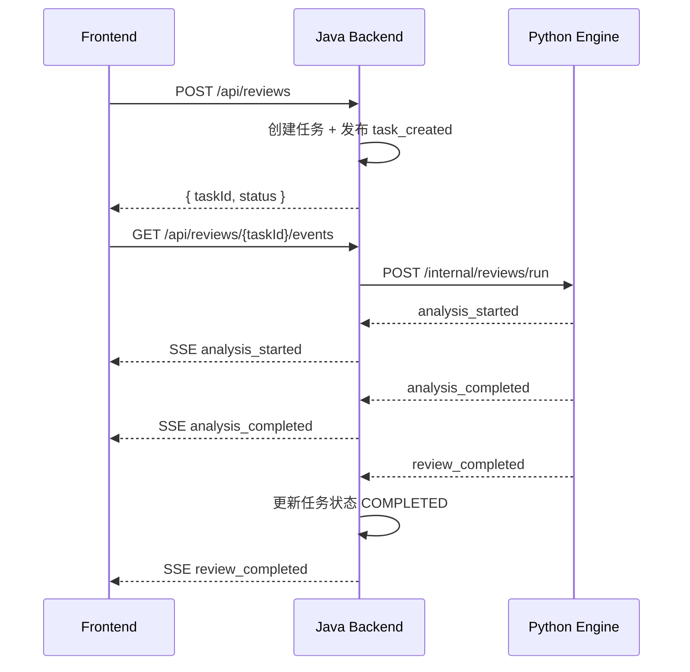

# Sentinel-CR Architecture (Day1 Bridge)

## 1. 文档目标

这份文档定义 Sentinel-CR 的 **Day1 实现边界**：

- **保留 Day0 已经跑通的公开 REST/SSE 协议与前端交互方式**
- **把执行链路从 Java 内部 Mock AI 升级为“Java 后端 + Python 引擎骨架”**
- **为 Day2 的 Tree-sitter / Semgrep / Symbol Graph 接入提前留出目录与状态结构**
- **继续把“事件协议稳定”放在“智能能力复杂”之前**

Day1 的核心不是做完整 Code Repair Agent，而是做一条真实可扩展的主链路：

```text
Frontend -> Spring Boot Backend -> Python AI Engine -> Java Event Bus -> SSE -> Frontend
```

---

## 2. Day0 基线与 Day1 升级方向

### 2.1 Day0 已有能力（必须保留）
Day0 已经完成了这些能力：

- 前端可提交 Java 代码片段
- 后端同步返回 `taskId`
- 前端可按 `taskId` 订阅 SSE
- 后端能推送统一 `ReviewEvent`
- 成功链路至少包含 4 个公开事件：
  - `task_created`
  - `analysis_started`
  - `analysis_completed`
  - `review_completed`
- 任务状态与事件序号已经围绕 `taskId + status + sequence` 建立

### 2.2 Day1 新增目标
Day1 只新增下面四件事：

1. 新增 `ai-engine-python/` 服务，可单独启动
2. Java 后端通过 `AiEngineAdapter` 调用 Python 服务，而不是只调用内部 mock
3. Python 侧建立最小状态机骨架与状态模型
4. Java 将 Python 返回的事件转换为现有 `ReviewEvent`，继续通过 SSE 推给前端

### 2.3 Day1 明确不做
下面这些能力不是 Day1 范围，禁止在今天扩散实现：

- 真实 Tree-sitter 解析
- 真实 Semgrep / CodeQL 扫描
- 真实 Patch 生成
- 真实 Compile / Lint / Test Verifier
- 数据库 / Redis / MQ
- PR 级分析入口
- Diff Viewer / Debug Panel 大改版
- Repo Memory / Case-based Memory 真正落地

Day1 的关键词只有三个：**接通、稳定、可扩展**。

---

## 3. 总体分层

## 3.1 Frontend UI（保持轻改或不改）
职责：

- 继续提交 review 请求
- 继续按 `taskId` 订阅 SSE
- 继续展示任务状态与事件时间轴
- 不感知 Java 背后到底是 Mock 还是 Python 引擎

Day1 对前端的要求：

- 尽量不改已有 API 层与页面状态机
- 允许继续使用现有 `POST /api/reviews`、`GET /api/reviews/{taskId}`、`GET /api/reviews/{taskId}/events`
- 允许展示 `payload.source`、`payload.stage` 等扩展字段，但不能依赖它们存在

> 前端的目标是“兼容 Day0 和 Day1”，不是重做 UI。

---

## 3.2 Java Backend（Day1 仍然是主协调器）
职责：

- 继续作为唯一公开 API 入口
- 创建任务并生成 `taskId`
- 维护任务状态与 sequence
- 提供 SSE 流
- 调用 `AiEngineAdapter`
- 将内部 `EngineEvent` 规范化为统一 `ReviewEvent`
- 在 Python 模式失败时，正确更新任务状态并发出 `review_failed`

Java 后端必须保留的核心对象：

- `ReviewController`
- `ReviewService`
- `ReviewTask`
- `ReviewTaskStatus`
- `ReviewEvent`
- `ReviewEventBus`
- `AiEngineAdapter`
- `MockAiEngineAdapter`

Java 后端 Day1 新增建议对象：

- `PythonAiEngineAdapter`
- `PythonEngineProperties`
- `PythonReviewRunRequest`
- `PythonEngineEvent`
- `EngineEventMapper`
- `AiEngineConfiguration`

---

## 3.3 Python AI Engine（新增最小真实服务）
Python 服务是 Day1 的新增重点，但它仍然只是骨架，不是完整智能引擎。

建议职责：

- 接收 Java 后端提交的任务
- 初始化最小状态对象
- 顺序执行最小状态机
- 产出统一的引擎事件流
- 把事件逐条返回给 Java 后端

Day1 推荐最小目录：

```text
ai-engine-python/
├── main.py
├── requirements.txt
├── core/
│   ├── state_graph.py
│   ├── schemas.py
│   └── events.py
├── agents/
│   └── __init__.py
├── analyzers/
│   └── __init__.py
└── prompts/
    └── __init__.py
```

### 3.3.1 Day1 最小 State
Python 侧必须至少有一个统一状态对象，字段对齐总计划：

```python
{
    "task_id": "rev_20260402_001",
    "code_text": "...",
    "language": "java",
    "issues": [],
    "issue_graph": [],
    "patch": None,
    "verification_result": None,
    "events": [],
    "retry_count": 0
}
```

说明：

- `issues`：Day1 先为空列表，为 Day2 的 Analyzer 做占位
- `issue_graph`：Day1 先为空列表，为 Day3 的 Planner 做占位
- `patch`：Day1 固定为 `None`
- `verification_result`：Day1 固定为 `None`
- `events`：记录本次引擎已发出的内部事件
- `retry_count`：Day1 固定为 `0`，为 Day5 自愈闭环预留

### 3.3.2 Day1 最小状态机
Day1 不必强求真正引入完整 LangGraph 执行器，但**目录与代码结构必须看起来可平滑切到 LangGraph**。

推荐最小阶段：

1. `bootstrap_state`
2. `run_analysis_stub`
3. `finalize_result`

对应事件：

1. `analysis_started`
2. `analysis_completed`
3. `review_completed`

> 如果 LangGraph 依赖接入成本不合适，可以先用普通 Python 函数组装出同样的状态推进逻辑，但文件名仍然保留 `state_graph.py`。

---

## 4. 通信链路设计

## 4.1 公开链路（不变）
```text
Frontend
  -> POST /api/reviews
Java Backend
  -> 立即返回 taskId
Frontend
  -> GET /api/reviews/{taskId}/events
Java Backend
  -> SSE 推送统一 ReviewEvent
```

## 4.2 内部链路（Day1 新增）
```text
Java Backend
  -> POST /internal/reviews/run (Python)
Python AI Engine
  -> StreamingResponse / NDJSON 返回内部事件
Java Backend
  -> 将内部事件转成 ReviewEvent
Java EventBus
  -> SSE 转发给 Frontend
```

### 为什么内部协议推荐 NDJSON，而不是再次用 SSE
推荐 `application/x-ndjson` 的原因：

- Java 作为客户端更容易逐行消费
- Python `FastAPI + StreamingResponse` 实现简单
- 与前端 SSE 协议解耦
- 更适合后端到后端的结构化流

---

## 5. 组件职责与边界

## 5.1 AiEngineAdapter 保持不变
Day1 必须遵守一个非常重要的原则：

> **不要改掉已经存在的 `AiEngineAdapter` 语义，只替换具体实现。**

推荐接口继续保持：

```java
public interface AiEngineAdapter {
    void startReview(ReviewTask task, Consumer<EngineEvent> eventConsumer);
}
```

解释：

- `ReviewService` 不关心背后是 Mock 还是 Python
- Day0 与 Day1 可以靠配置切换
- Day2 以后再加 analyzer/planner/fixer/verifier，也不需要推倒重来

## 5.2 推荐双实现并存
Day1 推荐同时保留两种引擎实现：

- `MockAiEngineAdapter`
- `PythonAiEngineAdapter`

通过配置切换：

```properties
sentinel.ai.mode=mock
# 或
sentinel.ai.mode=python
sentinel.ai.python-base-url=http://localhost:8000
```

这样做的好处：

- 现有 Day0 测试与演示不被破坏
- Python 引擎未启动时仍可回退 mock
- 本地调试更稳定

## 5.3 Java 是统一时间戳与 sequence 的唯一来源
Day1 仍然要求：

- `sequence` 只由 Java 后端分配
- 对前端可见的 `timestamp` 由 Java 后端统一生成
- 前端只信任 Java 推出的 `ReviewEvent`

原因：

- 避免 Python 与 Java 时钟不一致
- 避免事件重放时 sequence 断裂
- 保持与 Day0 行为一致

---

## 6. 推荐时序

## 6.1 正常成功链路



## 6.2 失败链路
如果 Python 调用失败、超时、返回非法事件或中途断流：

1. Java 必须将任务状态置为 `FAILED`
2. Java 必须发布 `review_failed`
3. `GET /api/reviews/{taskId}` 必须能看到错误信息
4. SSE 可在发出失败事件后结束

---

## 7. Day1 事件策略

Day1 有一个非常实际的约束：

> **Day0 已经有前端展示与后端集成测试，且成功链路默认是 4 个公开事件。**

因此 Day1 默认策略应为：

- **继续保留 4 个公开主事件**
  - `task_created`
  - `analysis_started`
  - `analysis_completed`
  - `review_completed`
- Python 内部更细的阶段信息优先放在 `payload.stage` 里
- 不要在默认成功路径里额外膨胀出很多新事件，除非你同步更新前端与测试

推荐做法：

```json
{
  "eventType": "analysis_started",
  "message": "python engine started state graph",
  "payload": {
    "source": "python-engine",
    "stage": "bootstrap_state"
  }
}
```

而不是直接再新增一个独立的公开事件 `state_graph_initialized`。

---

## 8. 目录与代码组织建议

## 8.1 backend-java
建议增量改造，不推翻 Day0 结构：

```text
backend-java/
└── src/main/java/com/backendjava/
    ├── api/
    ├── engine/
    │   ├── AiEngineAdapter.java
    │   ├── MockAiEngineAdapter.java
    │   ├── PythonAiEngineAdapter.java
    │   ├── EngineEvent.java
    │   ├── PythonEngineEvent.java
    │   └── EngineEventMapper.java
    ├── event/
    ├── service/
    ├── task/
    └── config/
```

## 8.2 ai-engine-python
Day1 只做骨架，但结构要为后面几天让路：

```text
ai-engine-python/
├── main.py
├── requirements.txt
├── core/
│   ├── state_graph.py
│   ├── schemas.py
│   └── events.py
├── analyzers/
├── agents/
├── memory/
└── prompts/
```

即使 `analyzers/`、`agents/`、`memory/` 先是空目录，也建议先建好。

---

## 9. 运行配置建议

## 9.1 Python 服务
默认：

- host: `0.0.0.0`
- port: `8000`

建议健康检查：

- `GET /health`

## 9.2 Java 服务
建议新增配置项：

```properties
sentinel.ai.mode=python
sentinel.ai.python-base-url=http://localhost:8000
sentinel.ai.python-connect-timeout-ms=3000
sentinel.ai.python-read-timeout-ms=15000
```

## 9.3 前端
前端默认仍然只配置：

```env
VITE_BACKEND_BASE_URL=http://localhost:8080
```

Day1 不让前端直连 Python。

---

## 10. 验收标准

到 Day1 结束时，必须满足：

### 10.1 功能验收
- 启动 Java、Python、Frontend 三个进程
- 页面提交任意 Java 代码片段
- 后端立即返回 `taskId`
- 前端能持续收到事件流
- 成功链路默认仍是 4 个公开事件
- 最终任务状态为 `COMPLETED`
- `payload.source` 能标识事件来自 `python-engine`

### 10.2 失败验收
- Python 未启动时，Java 能给出明确错误
- 任务状态进入 `FAILED`
- 前端能看到 `review_failed`
- 不允许任务永远卡在 `RUNNING`

### 10.3 工程验收
- `MockAiEngineAdapter` 仍然可切换使用
- 公开 API 路径不变
- `ReviewEvent` 顶层 schema 不变
- 代码结构为 Day2 Analyzer 留出位置

---

## 11. 开发原则

### 11.1 保守演进
Day1 不追求“多做”，只追求“把 Day0 换成真实 Python 链路”。

### 11.2 向后兼容
任何变更都不能破坏：

- 现有前端 API 调用
- 现有 SSE 数据结构
- 现有 `taskId + sequence + status` 语义

### 11.3 先骨架，后智能
Day1 的 Python 引擎是“可扩展骨架”，不是“完整 analyzer”。

### 11.4 所有未来复杂能力都挂在当前骨架上
Day2 以后新增的 Tree-sitter、Semgrep、Issue Graph、Patch、Verifier，都必须是在 Day1 的 task + state + event + adapter 基础上自然延伸。
