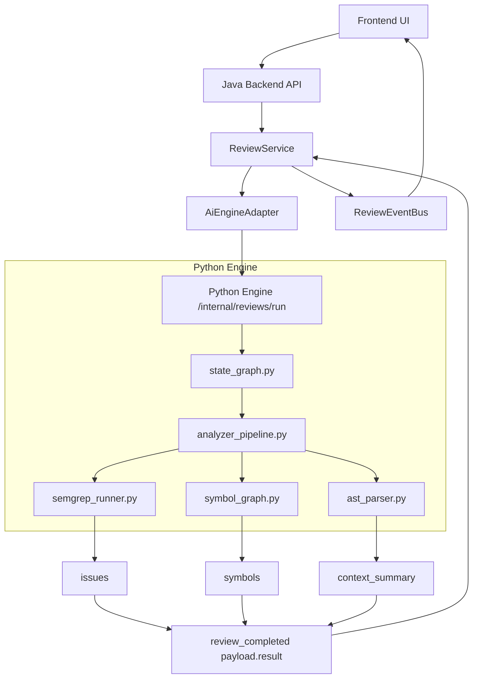
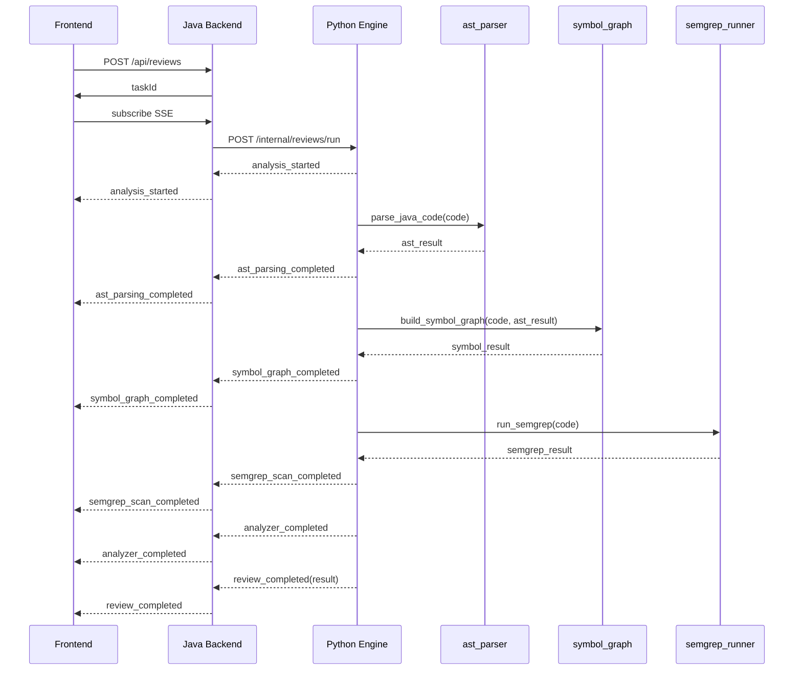

# Sentinel-CR Day 2 Architecture

## 1. 文档目标

本文说明 Sentinel-CR 在 Day 2 的架构落点：

- 当前 Day 1 已实现什么
- Day 2 新增哪些模块
- 各层之间如何协作
- 为什么 Day 2 只做 Analyzer，不提前把 Patch/Fixer 做复杂

Day 2 的唯一目标是：

> 把 **Tree-sitter + Symbol Graph + Semgrep** 变成一条稳定、可观测、可被后续 Planner/Fixer 消费的“确定性证据通路”。

---

## 2. 当前基线（Day 1 已完成）

Day 1 已经打通的链路是：

- 前端调用 Java Backend 创建任务
- Java Backend 通过 SSE 对外提供事件流
- Java Backend 把任务转发给 Python Engine
- Python Engine 以 NDJSON 事件流返回分析进度
- Java Backend 消费 Python 事件并广播给前端
- 任务最终落到 `ReviewTask.result`

也就是说，**Day 1 的主链路已经成立，Day 2 不需要重做传输层，而是补 Analyzer 能力本身**。

---

## 3. Day 2 架构原则

### 3.1 Analyzer 优先于 Agent

Day 2 先做：

- AST 解析
- symbol graph
- 规则扫描

而不是先做：

- Planner 智能排序
- Fixer 自动 patch
- 多阶段 verifier

原因很简单：如果底层证据层不稳定，后面所有 Agent 都会建立在猜测上。

### 3.2 结构化输出优先于自然语言输出

Day 2 的主要产物不是“分析报告”，而是：

- `issues`
- `symbols`
- `context_summary`
- `analyzer_summary`

自然语言摘要只作为补充。

### 3.3 事件驱动优先于单点返回

Day 2 不仅要“最终返回结果”，还要在过程中持续发事件，便于：

- 前端进度可视化
- 本地调试
- 后续 Debug Mode
- 快速定位失败阶段

### 3.4 向后兼容优先于大重构

Day 2 只允许做**最小必要重构**：

- 扩展 Python `EngineState`
- 增加 analyzer 模块
- 在 `state_graph.py` 中串起来

不建议在 Day 2 改动：

- Java 路由 URL
- 前端 API 调用方式
- ReviewTask 的基础生命周期

---

## 4. 目标组件图



---

## 5. 各层职责

## 5.1 Frontend UI

### 职责

- 提交代码片段
- 订阅 SSE
- 展示任务状态、事件流和最终结果摘要

### Day 2 不要求

- 不要求做复杂图可视化
- 不要求展示 AST 原始树
- 不要求渲染 issue graph

### Day 2 建议展示

- 当前阶段（AST / Symbol / Semgrep）
- issues 数量
- 类 / 方法 / 调用关系摘要
- 最终 analyzer summary

---

## 5.2 Java Backend

### 职责

- 作为前端唯一入口
- 维护任务对象生命周期
- 与 Python Engine 建立内部调用
- 将 Python 事件转成前端 SSE
- 持久化最终 `task.result`

### Day 2 不新增复杂逻辑

Java Backend 在 Day 2 主要仍做“编排层”，不做 Analyzer 本身。

### Java 保持稳定的原因

- Day 1 已打通公开 API
- Day 2 的主要增量在 Python
- 这样可以让迭代风险集中在一个子系统

---

## 5.3 Python Engine

### 职责

- 持有 Day 2 Analyzer 主逻辑
- 运行 AST / Symbol / Semgrep
- 汇总结果到统一结构
- 通过 NDJSON 连续输出事件

### Day 2 重点文件

- `core/state_graph.py`
- `analyzers/ast_parser.py`
- `analyzers/symbol_graph.py`
- `analyzers/semgrep_runner.py`
- 建议新增 `analyzers/analyzer_pipeline.py`

---

## 6. Python 内部模块分层

## 6.1 `core/`

### 作用

- 定义跨模块共享的 schema
- 提供事件构造方法
- 编排状态图执行顺序

### Day 2 应包含

- `schemas.py`：状态模型、事件模型
- `events.py`：统一 build_event
- `state_graph.py`：顺序编排 AST -> Symbol -> Semgrep -> finalize

---

## 6.2 `analyzers/`

### 作用

实现所有“确定性分析能力”，不承担 UI 或 HTTP 逻辑。

### 模块边界

#### `ast_parser.py`
负责语法树摘要：
- classes
- methods
- fields
- imports
- line range

#### `symbol_graph.py`
负责图关系：
- class -> method
- method -> method call
- variable -> usage

#### `semgrep_runner.py`
负责规则扫描：
- 规则调用
- 输出标准化 issues
- 处理 semgrep 不可用时的降级逻辑

#### `analyzer_pipeline.py`
负责把三个 Analyzer 结果聚合成统一 Day 2 输出。

---

## 7. Day 2 执行时序



---

## 8. 数据流设计

## 8.1 输入数据

唯一主输入仍是：

- `codeText`
- `language=java`
- `sourceType=snippet`

Day 2 暂不做：

- 仓库级上下文
- PR diff
- 多文件拉取
- MCP Resources

这些留到 Day 6 再做。

---

## 8.2 中间数据

Day 2 的中间数据流为：

```text
code_text
  -> ast_result
  -> symbol_graph
  -> semgrep_issues
  -> analyzer_result
  -> review_completed.payload.result
```

### 为什么这样设计

- AST 是 Symbol Graph 的上游输入
- Semgrep 与 AST 平行，可并行或顺序执行
- 最终统一汇总，供 Java 和前端消费

---

## 8.3 输出数据

Day 2 的最终输出分两类：

### A. 事件流输出
用于前端实时进度展示

### B. `task.result`
用于任务详情页、后续 Planner 输入、持久化查询

### 核心区别

- 事件流：过程态、轻量、强调可观测
- result：结果态、完整、强调结构化消费

---

## 9. 模块依赖建议

## 9.1 Python 依赖

Day 2 预期新增：

- `tree_sitter`
- `tree_sitter_java`
- `semgrep`

### 依赖策略建议

- `tree_sitter` / `tree_sitter_java`：强依赖
- `semgrep`：建议做“可降级强依赖”
  - 能用则返回 issues
  - 不可用则 diagnostics 告警并继续完成任务

---

## 9.2 测试依赖

推荐增加以下测试层：

1. AST 单测
2. Symbol Graph 单测
3. Semgrep 单测或集成测试
4. `state_graph.py` 事件流顺序测试

---

## 10. 事件设计与架构关系

Day 2 事件不是附属品，而是架构的一部分。

### 必须有的事件节点

- `analysis_started`
- `ast_parsing_started`
- `ast_parsing_completed`
- `symbol_graph_started`
- `symbol_graph_completed`
- `semgrep_scan_started`
- `semgrep_scan_completed`
- `analyzer_completed`
- `review_completed`
- `review_failed`

### 为什么要细分

因为后续所有调试问题都会落在这几个问题上：

- AST 没解析出来？
- Symbol Graph 没建出来？
- Semgrep 不可用？
- 最终结果序列化失败？

没有阶段化事件，就很难定位问题。

---

## 11. Day 2 非目标

为了防止范围失控，以下内容明确不属于 Day 2：

- Issue Graph Planner
- Patch 生成
- Multi-stage Verifier
- Repo-level Memory
- Lazy Context System
- PR 级入口
- benchmark 评测

这些会在 Day 3+ 按计划落地。

---

## 12. 推荐实现顺序

### Step 1
扩展 `schemas.py`，补齐 Day 2 state 字段

### Step 2
实现 `ast_parser.py`

### Step 3
实现 `symbol_graph.py`

### Step 4
实现 `semgrep_runner.py`

### Step 5
新增 `analyzer_pipeline.py`

### Step 6
重写 `state_graph.py`，把 stub 替换为真实 Analyzer 流程

### Step 7
补测试和示例输入

### Step 8
确认前端无需改 API 即可消费新事件

---

## 13. Day 2 完成后的架构状态

完成后，Sentinel-CR 的系统分层将变成：

### 已完成
- Event Stream 主链路
- Task 生命周期
- Python 状态图骨架
- AST / Symbol / Semgrep 确定性分析层

### 待完成
- Issue Graph Planner
- Fixer Agent
- Case-based Memory
- Verifier / Self-healing

这是一种非常健康的推进方式：

> 先把“证据层”做扎实，再把“智能决策层”叠上去。

---

## 14. Day 2 架构验收标准

满足以下条件可认为 Day 2 架构落地成功：

1. 不改现有前端 API 使用方式
2. Java Backend 不需要理解 AST 细节，只转发和持久化结构化结果
3. Python Engine 内部 Analyzer 边界清晰，不互相耦合
4. 任一阶段失败都能从事件流中定位
5. 最终结果能被 Day 3 Planner 直接复用
