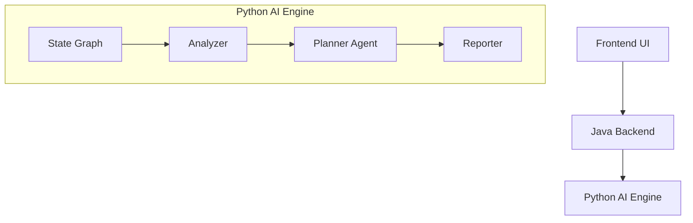

# Sentinel-CR Architecture（Day 3）

## 1. 文档目标

本文件描述 Sentinel-CR 在 **Day 3：Issue Graph Planner** 阶段的目标架构、组件职责、数据流和实现边界。

Day 3 不是去做更复杂的多智能体，而是把 Day 2 已有的 Analyzer 输出正式提升为：

> **Analyzer Evidence → Issue Graph → Repair Plan → Event Stream Result**

这一步会决定后续 Day 4 的 Fixer、Day 5 的 Verifier 是否有稳定输入可依赖。

---

## 2. 架构定位

Sentinel-CR 的核心不是“让大模型评论代码”，而是走一条可验证、可观测、可演进的工程主链路：

> **发现问题 → 组织问题 → 规划修复 → 生成补丁 → 验证补丁 → 失败重试 → 量化评测**

根据 README 和 7 天计划，系统整体主链路明确围绕以下模块展开：

> Analyzer → Issue Graph Planner → Fixer → Multi-stage Verifier → Event Stream → Benchmark fileciteturn0file0 fileciteturn0file1

Day 3 的职责是把“问题列表”升级成“修复图”和“修复计划”，这是后续 Fixer/Verifier 的中间层。README 明确指出 Issue Graph Planner 的输入来自 AST / symbol graph、Semgrep / CodeQL、变更文件与历史案例，输出则是带依赖、冲突、修复范围和测试要求的结构化问题对象。fileciteturn0file1

---

## 3. Day 3 目标

## 3.1 业务目标

把 Day 2 Analyzer 产出的：
- `issues`
- `symbols`
- `context_summary`

转成 Day 3 新增的：
- `issue_graph`
- `repair_plan`

并通过统一事件流推送给前端。

## 3.2 工程目标

1. 保持 Day 2 数据通路不被破坏
2. 保持 Python 内部入口稳定
3. 让前端能看到新增的 Planner 事件
4. 让最终 `review_completed` 结果可以直接给：
   - 前端展示
   - 自动化测试
   - 后续 Fixer Agent
   - Benchmark 评估

## 3.3 非目标

Day 3 不要求完成：
- Unified Diff Patch 生成
- Patch apply / compile / lint / test
- 自愈重试
- 仓库级记忆持久化

这些在 Day 4~Day 6 再逐步落地。计划中也明确把 Fixer 放在 Day 4、Verifier 放在 Day 5、Lazy Context 与 Repo Memory 放在 Day 6。fileciteturn0file0

---

## 4. 总体分层



### 4.1 Frontend UI
职责：
- 提交 Review 请求
- 订阅事件流
- 展示 Analyzer / Planner 结果
- 在 Debug 模式展示结构化 payload

### 4.2 Java Backend
职责：
- 外部 API Gateway
- review_id / task_id 管理
- 调用 Python 内部流式接口
- 把 NDJSON 转成 SSE
- 聚合最终结果供前端查询

### 4.3 Python AI Engine
职责：
- 执行状态机
- 调用 Analyzer
- 构建 Issue Graph
- 生成 Repair Plan
- 发出标准化事件
- 组装 `review_completed` 最终结果

---

## 5. 关键设计原则

## 5.1 Analyzer 是“证据层”，Planner 是“决策层”

README 对混合扫描引擎的定位很清楚：Tree-sitter 负责结构理解，Semgrep / CodeQL 负责确定性检测，LLM 不负责盲找问题，而负责合并证据、生成方案与后续反思。fileciteturn0file1

因此 Day 3 应遵循：
- Analyzer 输出是事实层
- Planner 输出是组织层
- 不允许 Planner 随意改写 Analyzer 的基础证据

## 5.2 契约必须独立于传输层

内部流是 NDJSON，前端流是 SSE，但事件对象必须共享同一套 JSON Envelope。这样：
- Python 不关心前端协议
- Java 只做转发/包装
- 前端只消费稳定事件类型与 payload

## 5.3 Planner 结果必须可被 Fixer 直接消费

README 和计划都强调 Day 3 不是只做排序，而是要决定：
- 哪些问题应该合并成一个 patch
- 哪些需要跨文件修复
- 哪些必须补上下文
- 哪些需要测试覆盖验证 fileciteturn0file0 fileciteturn0file1

所以 `repair_plan` 不能只是优先级列表，而必须包含：
- `strategy`
- `patch_group`
- `fix_scope`
- `blocked_by`
- `requires_context`
- `requires_test`

---

## 6. Day 3 关键组件职责

## 6.1 `ai-engine-python/core/issue_graph.py`

职责：
- 定义 Issue Graph DTO / dataclass / Pydantic model
- 提供从 `issues + symbols + context_summary` 到 `issue_graph` 的归一化构建逻辑
- 输出：
  - `nodes`
  - `edges`

建议内容：
- `IssueNode`
- `IssueEdge`
- `IssueGraph`
- `RepairPlanItem`
- `build_issue_graph(...)`
- `build_repair_plan(...)`

## 6.2 `ai-engine-python/agents/planner_agent.py`

职责：
- 接收 Analyzer 结果
- 调用 `issue_graph.py` 的构建逻辑
- 决定事件发射顺序
- 将结果写回 state

建议输出到 state：
- `issue_graph`
- `repair_plan`
- `planner_summary`

## 6.3 `ai-engine-python/core/state_graph.py`

职责：
- 在 Day 2 analyzer 节点之后新增 planner 节点
- 保证事件顺序正确
- 保证最终 `review_completed` 聚合包含 Day 3 新字段

建议节点顺序：
1. `review_started`
2. `analyzer_started`
3. `ast_parsed`
4. `symbols_extracted`
5. `semgrep_completed`
6. `analyzer_completed`
7. `planner_started`
8. `issue_graph_built`
9. `repair_plan_created`
10. `review_completed`

## 6.4 Reporter / Event Assembler

职责：
- 保证事件 envelope 统一
- 组装兼容 Day 2 的 `review_completed`
- 生成适合前端直接展示的 summary

---

## 7. 推荐状态对象

```json
{
  "task_id": "rev_20260402_001",
  "code_text": "...",
  "issues": [],
  "symbols": [],
  "context_summary": {},
  "issue_graph": {
    "nodes": [],
    "edges": []
  },
  "repair_plan": [],
  "patch": null,
  "verification_result": null,
  "events": [],
  "retry_count": 0
}
```

### 说明
- `patch` / `verification_result` 保留为空，为 Day 4~5 预留
- Day 3 的核心新增字段只有 `issue_graph` 与 `repair_plan`

---

## 8. Planner 构建逻辑建议

## 8.1 输入
- Analyzer issues
- Symbol graph / symbols
- Context summary
- （可选）用户约束

## 8.2 归一化规则

### 规则 A：一切从 `issues` 出发
每个 issue 至少要映射成一个 `IssueNode`。

### 规则 B：优先用 symbol 关联补全 `related_symbols`
如果 `issues` 中没有足够 symbol 信息，则根据：
- 文件名
- 行号
- 方法范围
- class 范围
补齐 `related_symbols`。

### 规则 C：依赖关系先做启发式，不做复杂图推理
Day 3 第一版可用如下启发式：
- 同一 symbol 且同一文件：默认可归为同 scope
- SQL 注入 / 资源释放 / 异常处理类：默认 `requires_test = true`
- 发生在同一行段、修改点可能重叠：加入 `conflicts_with`
- 上游校验类问题（如参数校验）可阻塞下游问题：加入 `depends_on`

### 规则 D：`repair_plan` 是执行视图
- 按严重度、依赖关系、冲突关系排序
- 相同 patch_group 的问题可以一次修复
- 被阻塞问题不得排在前面

---

## 9. Java Backend 的职责边界

虽然 Day 3 的核心逻辑在 Python，但 Java Backend 仍是系统边界控制点：

### 9.1 必须做的事
- 对外暴露统一 REST/SSE API
- 透传内部 Python 流式事件
- 维护 review 生命周期状态
- 保存最终结果快照

### 9.2 不应做的事
- 不在 Java 中重写 Planner 逻辑
- 不在 Java 中拼凑 issue_graph / repair_plan
- 不把业务语义拆散成多个地方维护

### 9.3 原则
- Java 管“入口、会话、转发、聚合”
- Python 管“分析、规划、结果对象”

---

## 10. 前端视角的架构要求

README 明确提出事件驱动 UI 的产品定位：用户模式看流程状态，调试模式看分析器结果、上下文选择、补丁迭代与失败原因。fileciteturn0file1

Day 3 对前端的最低要求是：

### 10.1 用户模式
能展示：
- 分析开始
- AST 解析完成
- Semgrep 扫描完成
- 问题图已构建
- 修复计划已生成
- 任务完成

### 10.2 Debug 模式
能查看：
- `analyzer_completed.payload`
- `issue_graph_built.payload.issue_graph`
- `repair_plan_created.payload.repair_plan`
- `review_completed.payload.result`

### 10.3 不要求
- 不要求 Day 3 就展示 patch diff
- 不要求 Day 3 就展示 verified level 标签

---

## 11. 兼容性策略

## 11.1 向后兼容
必须继续保留：
- 原内部入口
- 原 `review_completed.payload.result`
- 原事件主链路

## 11.2 向前兼容
Day 3 的对象命名要为 Day 4~6 预留：
- `strategy_hint` / `strategy`
- `requires_context`
- `requires_test`
- `patch_group`
- `verification_result`

这些字段会在后续 Fixer / Verifier / Lazy Context 中直接复用。计划中也明确了 Day 4 会引入结构化案例库和统一 diff 输出，Day 5 会加入多阶段验证，Day 6 会补齐 Lazy Context 与 Repo-aware 输入。fileciteturn0file0

---

## 12. 建议实现顺序

### Step 1
补齐 `issue_graph.py` 的结构定义与构建函数。

### Step 2
补齐 `planner_agent.py`，输出 `issue_graph` 与 `repair_plan`。

### Step 3
在 `state_graph.py` 中插入 planner 阶段。

### Step 4
补齐事件类型：
- `planner_started`
- `issue_graph_built`
- `repair_plan_created`

### Step 5
更新 `review_completed` 聚合对象。

### Step 6
补充 Day 3 验收测试。

---

## 13. Day 3 完成标准

满足以下条件即视为 Day 3 完成：

1. 输入一段 Java 代码
2. Day 2 Analyzer 正常输出 `issues/symbols/context_summary`
3. Day 3 Planner 正常输出 `issue_graph`
4. Day 3 Planner 正常输出 `repair_plan`
5. 事件流中能看到：
   - `issue_graph_built`
   - `repair_plan_created`
6. `review_completed` 中同时可读取：
   - `payload.result.issue_graph`
   - `payload.result.repair_plan`
   - 顶层镜像 `issue_graph`
   - 顶层镜像 `repair_plan`

---

## 14. 一句话总结

Day 3 的本质不是“多加一个 Agent”，而是给整个系统补上一个 **稳定的中间决策层**：

> **Analyzer 负责找到问题，Planner 负责把问题变成可执行的修复计划。**

只有这层契约稳定了，Day 4 的 Fixer 才不会盲修，Day 5 的 Verifier 才有明确验证对象。
