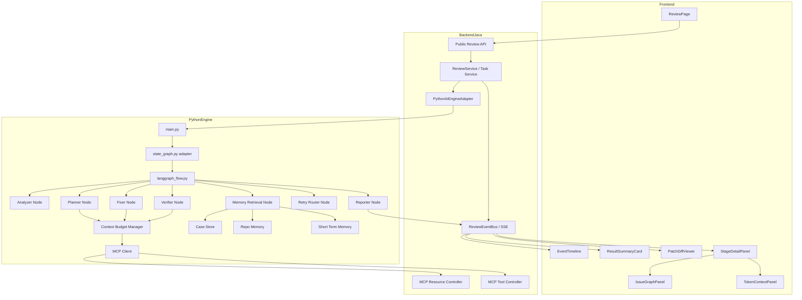
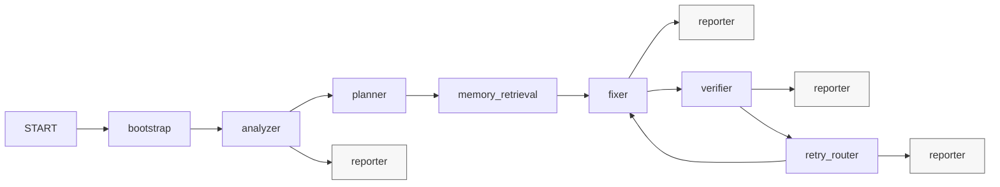

# Sentinel-CR Day6 Architecture

## 1. 文档定位

本文档描述 Sentinel-CR 在 **Day6「平台能力日」** 的目标架构。

它不是 README 的抽象蓝图复述，而是基于当前已经跑通的 Day5 代码基线，给出一个 **可直接指导实现的增量架构**。

核心原则只有一句：

> **在不破坏现有 Day5 snippet 闭环的前提下，把系统升级为 Day6 平台骨架。**

---

## 2. 当前真实基线（Day5）

## 2.1 已经存在并且能跑通的主链
当前仓库已经具备一条可运行链路：

1. 前端提交 Java snippet
2. Java backend 创建任务并通过 SSE 向前端推送事件
3. backend 调用 Python 引擎 `/internal/reviews/run`
4. Python 侧执行：
   - analyzer
   - planner
   - case memory
   - fixer
   - verifier / retry
   - reporter
5. 前端已经可以展示：
   - Event Timeline
   - Result Summary
   - Patch Diff

---

## 2.2 Day5 的真实实现边界

### Python 引擎
- `main.py` 仍直接调用 `run_day3_state_graph`
- 当前 `state_graph.py` 还是手写 orchestrator，不是真正的 LangGraph
- `memory/` 目前只有 `case_memory.py`
- verifier 的 `lint / test / security_rescan` 还只是结构化占位

### Java backend
- public API 已有：
  - `POST /api/reviews`
  - `GET /api/reviews/{taskId}`
  - `GET /api/reviews/{taskId}/events`
- event stream 顺序、timestamp、任务状态已经由 backend 统一管理
- 还没有 MCP 风格的 resources / tools 接口

### Frontend
- 已有 timeline / summary / diff
- 还没有：
  - Issue Graph 可视化
  - token / context budget 面板
  - 真实 repo-aware context 展示
- 侧边栏历史记录还是占位数据

---

## 2.3 Day6 与 Day7 的边界
Day6 的重点不是：

- 最终训练平台
- 最终 benchmark 大盘
- 最终 repo / PR 产品化入口
- 完整历史会话系统

Day6 的重点是：

1. 真正接入 LangGraph  
2. 完成三层记忆  
3. 打通 MCP + Lazy Context  
4. 前端展示 Issue Graph 与 Context Budget  
5. 把 verifier 提升到真实 L2/L3/L4 骨架  

---

## 3. Day6 的目标架构



---

## 4. 分层职责

## 4.1 Frontend：从“看事件”升级到“看平台状态”
Day5 前端已经能看 timeline / diff / summary。  
Day6 前端要在此基础上增加两个关键视图：

### A. IssueGraphPanel
目标：把 `issue_graph_built` 事件与最终 `result.issue_graph` 可视化。

要求：

- 支持节点点击
- 节点详情联动修复策略
- 可切换：
  - 问题依赖图
  - 文件 / symbol 影响图
- 数据源优先级：
  1. `review_completed.payload.result.issue_graph`
  2. 最新的 `issue_graph_built.payload.issue_graph`

### B. TokenContextPanel
目标：展示 Lazy Context 的实际消耗，而不是只在后端算。

要求：

- 展示总预算 / 已用 / 剩余
- 展示当前 `load_stage`
- 展示当前 context sources
- Debug 模式下展示：
  - why this file
  - why this symbol
  - token_count
  - source kind

### C. StageDetailPanel 保留并升级
Day5 的 `StageDetailPanel` 已经可用于 debug payload。  
Day6 不要推翻它，而是把它升级为容器：

- `Overview`
- `Issue Graph`
- `Context`
- `Verification`
- `Memory`
- `Raw Payload`

---

## 4.2 Java Backend：继续做外部权威层 + 补上 MCP
Backend 在 Day6 里不应该被降级为“纯转发器”。它继续承担三件核心事：

### A. 维持 public API 稳定
继续保留：

- `POST /api/reviews`
- `GET /api/reviews/{taskId}`
- `GET /api/reviews/{taskId}/events`

### B. 维持任务与外部事件权威
backend 仍然是外部事实源：

- task 状态
- createdAt / updatedAt
- event `timestamp`
- event `sequence`
- SSE stream 生命周期

### C. 新增 MCP 能力
Day6 新增 internal endpoints：

#### Resources
- `/internal/mcp/resources/repo-tree`
- `/internal/mcp/resources/file`
- `/internal/mcp/resources/schema`
- `/internal/mcp/resources/build-log-summary`
- `/internal/mcp/resources/test-summary`
- `/internal/mcp/resources/pr-diff/parse`

#### Tools
- `/internal/mcp/tools/resolve-symbol`
- `/internal/mcp/tools/find-references`
- `/internal/mcp/tools/run-analyzer`
- `/internal/mcp/tools/run-sandbox`
- `/internal/mcp/tools/query-tests`

### D. DTO 层的 Day6 关键修复
目前 public `CreateReviewRequest` 还没有 `metadata`，但 Python internal request 已经有 `metadata`。  
Day6 必须把这个断层补齐：

- public DTO 增加可选 `metadata`
- ReviewService / Adapter 做原样透传
- 不提供时默认 `{}`

---

## 4.3 Python Engine：Day6 的重心所在
Python 引擎是 Day6 的主要升级区域。

### 当前问题
当前 `state_graph.py` 是手写流程编排，虽然能跑，但与 README/PLAN 里的 LangGraph 定位不一致。

### Day6 目标
改造成：

- 真正的 `langgraph_flow.py`
- `state_graph.py` 只做 wrapper / adapter
- 保持原 `run_day3_state_graph(...)` 调用入口仍可用

---

## 5. LangGraph 工作流设计

## 5.1 节点图



---

## 5.2 节点职责

### bootstrap
输入：
- request
- options
- metadata

输出：
- 初始化 `EngineStateV2`
- 初始化 `context_budget`
- 发 `analysis_started`
- 可选发 `context_budget_initialized`

### analyzer
输入：
- `code_text`
- `language`

输出：
- `issues`
- `symbols`
- `context_summary`
- `analyzer_summary`
- `diagnostics`

保留当前 analyzer 相关事件名：

- `ast_parsing_started`
- `ast_parsing_completed`
- `symbol_graph_started`
- `symbol_graph_completed`
- `semgrep_scan_started`
- `semgrep_scan_completed`
- `semgrep_scan_warning`
- `analyzer_completed`

### planner
输入：
- analyzer evidence

输出：
- `issue_graph`
- `repair_plan`
- `planner_summary`

保留事件名：

- `planner_started`
- `issue_graph_built`
- `repair_plan_created`
- `planner_completed`

### memory_retrieval
输入：
- `issues`
- `repair_plan`
- `symbols`
- `context_summary`
- `metadata.repo_profile_id`

输出：
- `memory_matches`
- `short_term_memory`
- `repo_profile`
- `case_store_summary`

新增事件：

- `repo_memory_loaded`
- `short_term_memory_updated`
- `case_memory_search_started`
- `case_memory_matched`
- `case_memory_completed`

### fixer
输入：
- `repair_plan`
- `memory_matches`
- `short_term_memory.latest_verifier_failure`
- selected context

输出：
- `patch_artifact`
- `attempt`

保留事件名：

- `fixer_started`
- `patch_generated`
- `fixer_completed`
- `fixer_failed`

### verifier
输入：
- `patch_artifact`
- `context_budget`
- repo profile 中的 build / test 命令

输出：
- `verification_result`

保留事件名：

- `verifier_started`
- `<stage>_started`
- `<stage>_completed`
- `<stage>_failed`
- `verifier_completed`
- `verifier_failed`

### retry_router
输入：
- `verification_result`
- `retry_count`
- `max_retries`

输出：
- 更新 `retry_count`
- 写回 `short_term_memory.latest_verifier_failure`
- 决定去 `fixer` 还是 `reporter`

保留事件名：

- `review_retry_scheduled`
- `review_retry_started`

### reporter
输入：
- 最终 `EngineState`

输出：
- `review_completed` 或 `review_failed` payload
- 最终 `result` block

---

## 5.3 推荐状态模型（EngineStateV2）

```python
class EngineStateV2(TypedDict, total=False):
    task_id: str
    code_text: str
    language: str

    issues: list[dict]
    symbols: list[dict]
    context_summary: dict
    analyzer_summary: dict
    diagnostics: list[dict]

    issue_graph: dict
    repair_plan: list[dict]
    planner_summary: dict

    memory_matches: list[dict]
    short_term_memory: dict
    repo_profile: dict
    case_store_summary: dict

    context_budget: dict
    selected_context: list[dict]
    tool_trace: list[dict]

    patch_artifact: dict | None
    attempts: list[dict]
    verification_result: dict | None

    enable_verifier: bool
    enable_security_rescan: bool
    max_retries: int
    retry_count: int
    no_fix_needed: bool

    final_status: str
    events: list[dict]
```

### 迁移原则
- 不要求一次性把现有 Pydantic `EngineState` 全部换掉
- 允许 Day6 先用“Pydantic model + LangGraph wrapper”混合模式
- 但必须让 `langgraph_flow.py` 成为真实 orchestration source

---

## 6. 三层记忆架构

## 6.1 Short-term Memory
职责：承载“本次任务上下文”和“重试上下文”。

至少保存：

- 最近一次 analyzer evidence
- 最近一次 patch
- 最近一次 verifier failure
- retry context
- 用户约束
- token 消耗摘要

推荐文件：
- `memory/short_term.py`

---

## 6.2 Long-term Case Memory
职责：把静态 `case_memory.py` 升级成可持久化的结构化案例库。

推荐拆分：

- `memory/case_memory.py`：检索接口
- `memory/case_store.py`：底层 JSONL / sqlite / duckdb 读写
- `data/cases/*.jsonl`

### 必备能力
- `retrieve_case_matches(...)`
- `promote_verified_patch_to_case(...)`

### Day6 关键原则
- 保留当前静态 case 检索逻辑的兼容路径
- 但新增持久化 case store，避免以后再重构一次

---

## 6.3 Repo-level Memory
职责：让 agent 不只是“懂通用修复”，还要“懂这个仓库的偏好”。

至少包含：

- style preferences
- common issue types
- common failed stages
- preferred build command
- preferred test command
- rejected patch patterns
- hotspots / risky symbols

推荐文件：
- `memory/repo_memory.py`
- `data/repo_profiles/*.json`

---

## 7. Lazy Context + MCP

## 7.1 为什么 Day6 必须引入
当前 snippet 场景还能直接塞给 Fixer；一旦扩到 repo / PR 级，上下文一定爆炸。  
所以 Day6 必须先把机制搭起来，即使 public 入口还没全面放开。

---

## 7.2 Context Budget Manager 设计
推荐文件：
- `core/context_budget.py`

### 关键职责
1. 初始化 token 预算  
2. 记录每次资源加载的 token 消耗  
3. 根据 policy 决定下一步拉什么上下文  
4. 在预算不足时发 `context_budget_exhausted`

### 推荐策略
优先级从高到低：

1. issue 附近 snippet window
2. symbol summary
3. impacted file fragment
4. build / test summary
5. full file

### 建议数据结构
```json
{
  "enabled": true,
  "policy": "lazy",
  "budget_tokens": 12000,
  "used_tokens": 2480,
  "remaining_tokens": 9520,
  "load_stage": "symbol_graph",
  "sources": []
}
```

---

## 7.3 MCP Client 设计
推荐文件：
- `core/mcp_client.py`

### 作用
让 Planner / Fixer / Verifier 能以统一方式按需拉：

- 文件片段
- symbol 定义 / 引用
- build log summary
- test summary
- sandbox 执行结果

### 设计要求
- Python 侧只依赖 MCP client，不直接假设 backend 内部实现
- 所有调用都记录到 `tool_trace`
- 所有上下文加载都同步更新 `context_budget`

---

## 8. Verifier：从 L1 到真实 L2/L3/L4 骨架

## 8.1 Day5 的问题
虽然当前已经有 `verified_level` 概念，但：

- lint 还是 skipped
- test 还是 skipped
- security rescan 还是 skipped

这说明“等级定义已经有了，真实 stage runner 还没跟上”。

---

## 8.2 Day6 的目标
新增 / 重构：

- `tools/lint_runner.py`
- `tools/test_runner.py`
- `tools/security_rescan.py`

并在 `agents/verifier_agent.py` 中统一接入。

---

## 8.3 Stage 设计

### L1
- `patch_apply`
- `compile`

### L2
- `lint`

### L3
- `test`

### L4
- `security_rescan`

---

## 8.4 Stage 结果约束
每个 stage 必须产出统一结构：

```json
{
  "stage": "compile",
  "status": "passed",
  "exit_code": 0,
  "stdout_summary": "",
  "stderr_summary": "",
  "reason": null,
  "retryable": false
}
```

### 允许的 `status`
- `passed`
- `failed`
- `skipped`

### Day6 关键规则
- 没配置命令时允许 `skipped`
- 但必须是结构化 `skipped`
- 不允许因为“暂未配置”直接抛异常中断整条主链

---

## 9. Frontend 落地方案

## 9.1 保留现有组件
Day6 不应该重写已有 UI，而是增量扩展。保留：

- `EventTimeline.vue`
- `ResultSummaryCard.vue`
- `PatchDiffViewer.vue`
- `StageDetailPanel.vue`
- `ReviewPage.vue`

---

## 9.2 新增组件
推荐新增：

- `IssueGraphPanel.vue`
- `TokenContextPanel.vue`

可选新增：
- `MemoryPanel.vue`

---

## 9.3 数据读取优先级
### Issue Graph
1. `review_completed.payload.result.issue_graph`
2. 最新 `issue_graph_built.payload.issue_graph`

### Context Budget
1. `review_completed.payload.result.context_budget`
2. 最新 `context_budget_updated.payload.context_budget`
3. 最新 `context_resource_loaded.payload.context_budget`

### Verification
1. `review_completed.payload.result.verification`
2. verifier 事件流累积快照

---

## 9.4 非目标
以下内容不要求在 Day6 彻底完成：

- 左侧真实历史任务系统
- benchmark 可视化大盘
- 最终多模式输入切换
- 训练 / 微调台

这些属于 Day7 范围。

---

## 10. 推荐代码变更清单

## 10.1 Python
必须新增或重构：

- `ai-engine-python/core/langgraph_flow.py`
- `ai-engine-python/core/state_graph.py`
- `ai-engine-python/core/context_budget.py`
- `ai-engine-python/core/mcp_client.py`
- `ai-engine-python/memory/short_term.py`
- `ai-engine-python/memory/repo_memory.py`
- `ai-engine-python/memory/case_store.py`
- `ai-engine-python/tools/lint_runner.py`
- `ai-engine-python/tools/security_rescan.py`
- `ai-engine-python/tests/test_langgraph_flow.py`

---

## 10.2 Backend Java
推荐新增：

- `backend-java/.../mcp/McpResourceController.java`
- `backend-java/.../mcp/McpToolController.java`
- `backend-java/.../mcp/McpResourceService.java`
- `backend-java/.../mcp/McpToolService.java`

推荐修改：

- `CreateReviewRequest.java`
- `ReviewService.java`
- `PythonAiEngineAdapter.java`

---

## 10.3 Frontend
推荐新增：

- `frontend-ui/src/components/IssueGraphPanel.vue`
- `frontend-ui/src/components/TokenContextPanel.vue`

推荐修改：

- `frontend-ui/src/views/ReviewPage.vue`
- `frontend-ui/src/components/StageDetailPanel.vue`
- `frontend-ui/src/types/review.ts`
- `frontend-ui/src/utils/reviewEventView.ts`

---

## 11. Day6 架构验收标准

到 Day6 结束时，必须满足：

1. 真实接入 LangGraph  
2. `state_graph.py` 退化为 adapter，而不是主流程真身  
3. 有短期 / 长期 / 仓库级记忆三层  
4. 有 MCP resources / tools 双通道  
5. 有 Lazy Context 和 token 预算  
6. 前端能看到 Issue Graph  
7. 前端能看到 context/token 使用  
8. verifier 至少能输出真实 L2/L3/L4 stage 结果骨架  
9. 旧的 Day5 snippet 闭环仍然可跑  
10. 零问题样本、正常修复样本、重试样本都能正常收口  

---

## 12. 实施策略建议

推荐按下面顺序实现，风险最低：

1. 先补 contract 与类型  
2. 再把 `state_graph.py -> langgraph_flow.py` 做 adapter 化  
3. 然后补 memory / context_budget / mcp_client  
4. 接着补 backend MCP endpoints  
5. 再补 verifier 的 stage runners  
6. 最后补前端 IssueGraph / Context 面板  

这样做的好处是：

- 任何阶段都不会把 Day5 主链直接打断
- 先让后端 / Python / 前端共享同一份 contract
- 再逐步把 README 中的 Day6 理想态落到真实代码上
